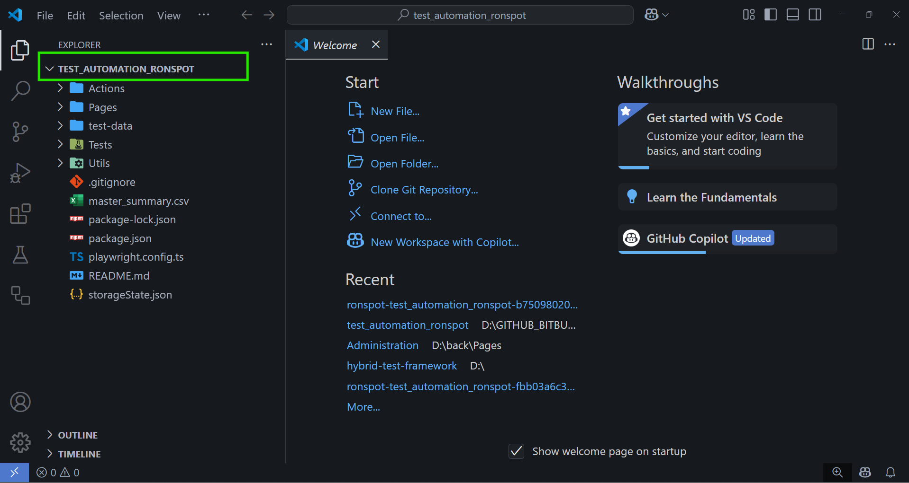
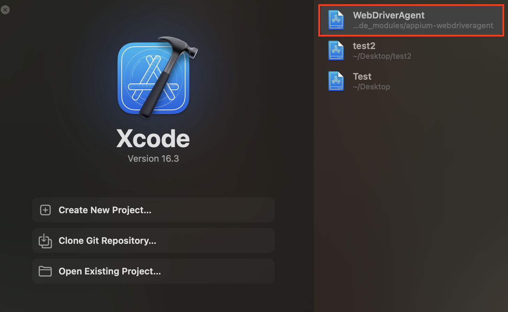
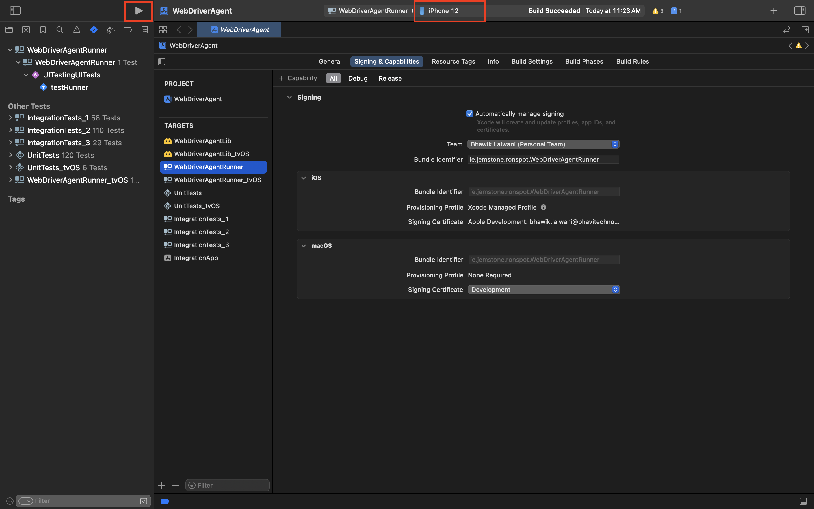

# 🚀 Ronspot Hybrid Test Automation Framework
 
This repository contains a hybrid test automation framework for:
 
* ✅ Web automation for Admin and Member portals using **Playwright with TypeScript**
* 📱 Mobile testing on **Android & iOS using WebDriverIO with JavaScript**
* 🔥 Load testing using **K6 with JavaScript**
 
---
 
## Prerequisites
 
🟩 **Node.js (version: v20.11.1)**
To verify installed Node version:
 
```bash
node -v
```
 
Download Node.js:
 
```bash
https://nodejs.org/en/download
```
 
**npm (Node Package Manager)**
To verify installed npm version:
 
```bash
npm -v
```
 
---
### 🔐 Bitbucket Repository Access
 
Make sure your Bitbucket account has access to this private repository:
 
---
 
### 🔧 Git (Required)
Download and install Git for Windows, which includes **Git Bash**:
 
```bash
https://git-scm.com/download/win
```
 
---
 
🧰 **Visual Studio Code** (Recommended Editor)
Download and install from:
 
```bash
https://code.visualstudio.com/
```
 
🧩 **Recommended VS Code Extensions**
Make sure to install:
 
* Playwright Test for VS Code (Microsoft)
- Playwright Test Runner Plugin Installed
 
---
 
## 📥 Clone This Repository
 
Replace `<your-username>` with your Bitbucket username:
 
```bash
git clone https://<your-username>@bitbucket.org/ronspot/test_automation_ronspot.git
```
---
 
### 📦 Example: Clone with Your Username
 
If your Bitbucket username is `akshaykankodia`, use:
 
```bash
git clone https://akshaykankodia@bitbucket.org/ronspot/test_automation_ronspot.git
```
---
 
📂 **Open Project in Root Directory**
 
After cloning the repo, open the project from the root folder (`test_automation_ronspot`) in VS Code to ensure all tools and relative paths work correctly.
 

 
 
---
 
🧱 **Install project dependencies:**
```bash
npm install
```
---
 
 
🌐 **Install Playwright browsers:**
```bash
npx playwright install
```
---
 
📈 **K6 (for load testing)**
Install on Windows using PowerShell (via Chocolatey):
```powershell
choco install k6
```
---
 
## 📁 Project Structure
 
```bash
├── Tests/  
│   ├── Admin/       # Playwright TS tests for Admin web
│   ├── LoadTest/    # K6 load testing scripts
│   ├── Member/      # Playwright TS tests for Member web
│   └── mobile/      # WebDriverIO JS tests (Android/iOS)
│       ├── android/
│       └── ios/                
├── Config/                      
├── test-data/                  
├── utils/                      
└── README.md
```
 
---
 
## 🧪 Run Web Tests (Playwright)
 
### Run All Tests
 
```bash
npx playwright test
```
 
### Run Specific Project (Admin/Member) With Log Output
 
```bash
npm run test:admin
```
 
```bash
npm run test:member
```
 
### Run Specific Folder (Admin/Member)
 
```bash
npx playwright test Admin/admin_testScript.spec.ts
```
 
```bash
npx playwright test Member/testScript.spec.ts
```
 
### Generate HTML Report
 
```bash
npx playwright show-report
```
 
---
 
⚡ **Run Load Tests (K6)**
 
### Using npm script
```bash
npm run runload -- Login_Load_Test.js
```
 
### Direct K6 command
```bash
k6 run LoadTests/testScript.js
```
 
---

# 📱 Mobile Test Automation Setup (iOS + Android)

## ✅ Prerequisites

### 💻 System Requirements
- macOS with admin rights
- Node.js (v22.16.0)
- npm
- Java JDK (v11)
- Xcode (latest version)
- Appium (2.x)

---

## ⚙️ Install Tools

### 📦 Install Xcode
Install via App Store or run:
```bash
xcode-select --install
```

### Accept Xcode License
```bash
sudo xcodebuild -license accept
```

### Install Appium
```bash
npm install -g appium
```

###  Install Project Dependencies(npm install)
```bash
npm install
```

### 📱 iOS Testing Setup
### Requirements
- Xcode installed and configured
- Real iOS device with developer mode enabled
- WebDriverAgent setup Manual

### 🚀 Appium Drivers for iOS
Install the xcuitest driver:
```bash
appium driver install xcuitest
```

### 📁 Step 1: Locate WebDriverAgent Project

- Open WebDriverAgent project in Xcode 
- WebDriverAgent is bundled with the Appium xcuitest driver. The path is: (Change according to you system path)
```bash
/usr/local/lib/node_modules/appium/node_modules/appium-xcuitest-driver/WebDriverAgent
npm list -g appium-xcuitest-driver
```

### 🛠 Step 2: Open WebDriverAgent in Xcode
```bash
open /usr/local/lib/node_modules/appium/node_modules/appium-xcuitest-driver/WebDriverAgent/WebDriverAgent.xcodeproj
```
or open manually



### 🔐 Step 3: Configure Signing & Capabilities in Xcode
For both WebDriverAgentLib and WebDriverAgentRunner targets:

In Xcode, select:

1. WebDriverAgentLib
2. WebDriverAgentRunner

Then go to: TARGETS → Signing & Capabilities

Set: Your Apple Developer Team

Add: Unique Bundle Identifier (ie.jemstone.ronspot.WebDriverAgentRunner)


### 🔌 Step 4: Connect and Verify iOS Device
Plug in your real device and trust it. Then run:
```bash
xcrun xctrace list devices
```
This shows all connected iOS devices. You should see your device like:
e.g iPhone 14 Pro Max (17.2) (00008030-001D114E345C002E)

### ▶ Step 5: Build & Run WDA from Xcode

Select **WebDriverAgentRunner** as the target scheme (top left in Xcode)
Select your **real device** from the device list
Press ▶ (**Run**)
This will show “Build Succeeded”.

- Click on Product
- Click on Test

This will: Build WDA and install it on your device
Now Trust the developer on your iPhone

- Go To Settings → General → VPN & Device Management
- Tap your Apple ID profile under "Developer App"
- Tap "Trust [Your Apple ID]"
- Confirm by tapping "Trust"
- Tap on "Allow". (till Verifyed)

Now you’ll see **"Automation Running"** on your screen



### Run iOS Tests via WebDriverIO
* npm run test android testscript name
```bash
npm run test ios login
```

### 🤖 Android Testing Setup (Mac OS)

- Android Studio installed
- Enable USB Debugging & Developer Options on the device
- Set Android Environment Variables (if already set ignore)
- If not already set, add to your 
```bash
~/.zshrc or ~/.bash_profile
```

```bash
export ANDROID_HOME=$HOME/Library/Android/sdk
export PATH=$PATH:$ANDROID_HOME/emulator
export PATH=$PATH:$ANDROID_HOME/platform-tools
```
Apply changes:
```bash
source ~/.zshrc
```
or
```bash 
source ~/.bash_profile
```

Verify Connected Devices
```bash
adb devices
```

-------

### 🤖 Android Testing Setup (Windows)

- Install Android Studio
- Enable USB Debugging & Developer Options on the Android device
- Set Android Environment Variables
If not already set, follow these steps:

➤ Set Environment Variables:
- Open Start Menu → Search: “Environment Variables” → Edit the system environment variables
- In System Properties, click Environment Variables
- Under User variables or System variables, click New, and add:

- Variable Name	 Variable Value
- ANDROID_HOME	 C:\Users\<YourUsername>\AppData\Local\Android\Sdk
- JAVA_HOME	  Path to your JDK (e.g., C:\Program Files\Java\jdk-<version>)

- Edit the Path variable → Click Edit → Add the following:
```bash
%ANDROID_HOME%\platform-tools
%ANDROID_HOME%\emulator
%ANDROID_HOME%\tools
%ANDROID_HOME%\tools\bin

```

Click OK to save and close all dialogs

➤ Apply Changes:
Restart Command Prompt or PowerShell

➤ Verify Connected Devices:
```bash
adb devices
```

### Run Android Tests
npm run test android testscript name
```bash
npm run test android login

```

### Run Parallel (Android + iOS)
```bash
npm run test android login & npm run test ios login
```

## 🆘 Troubleshooting
Appium not found?
Ensure it's installed globally:
```bash
npm install -g appium
```
## Playwright browsers not installed?
Run:
```bash
npx playwright install
```

## 🌐 Notes

* Make sure Android/iOS devices/emulators are connected and configured.
* Web tests use POM and reusable action classes for better structure.
* K6 load scripts use modular JavaScript for endpoint-level testing.

---

## 📩 Feedback & Contribution

Feel free to fork, raise issues, or contribute improvements. PRs are welcome!
